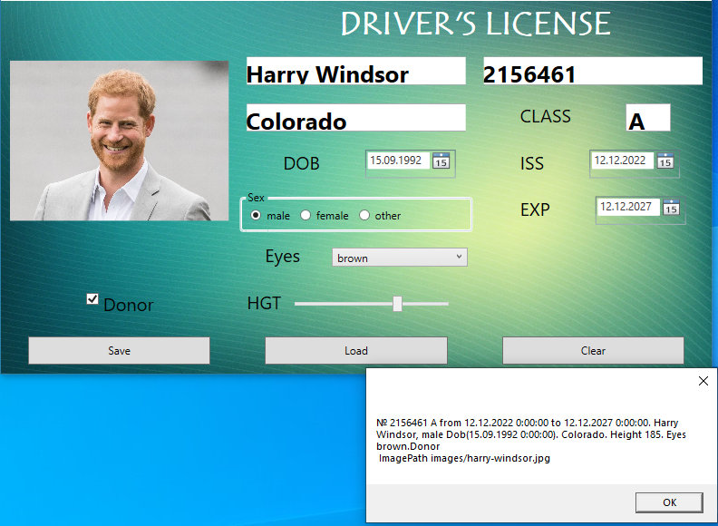
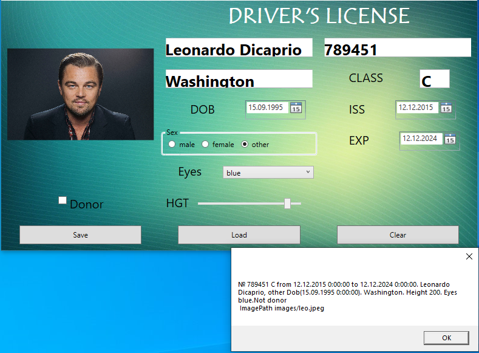
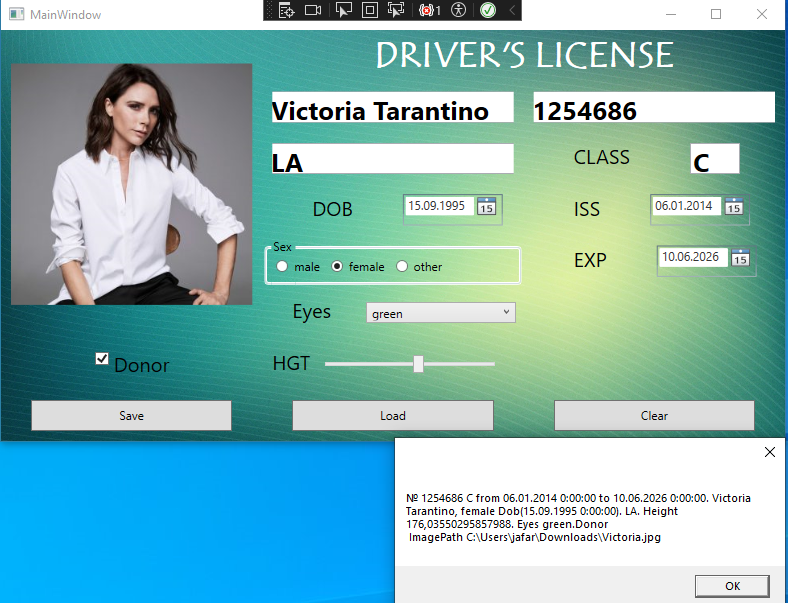
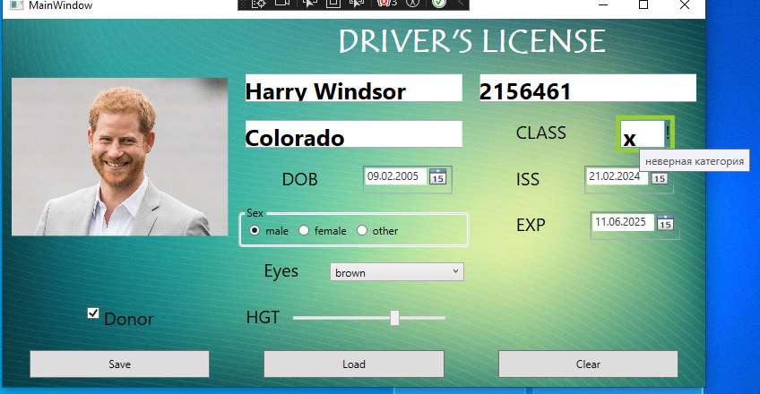
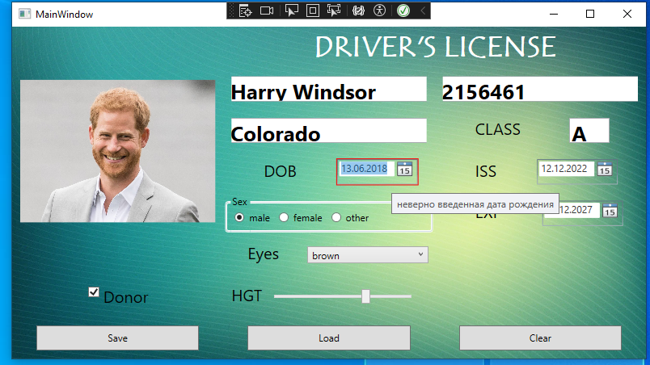
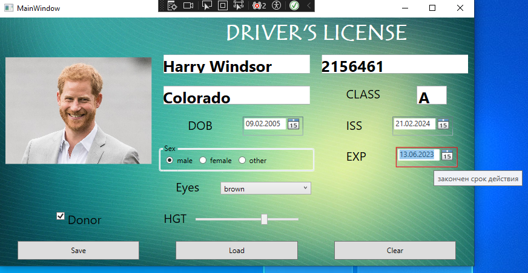
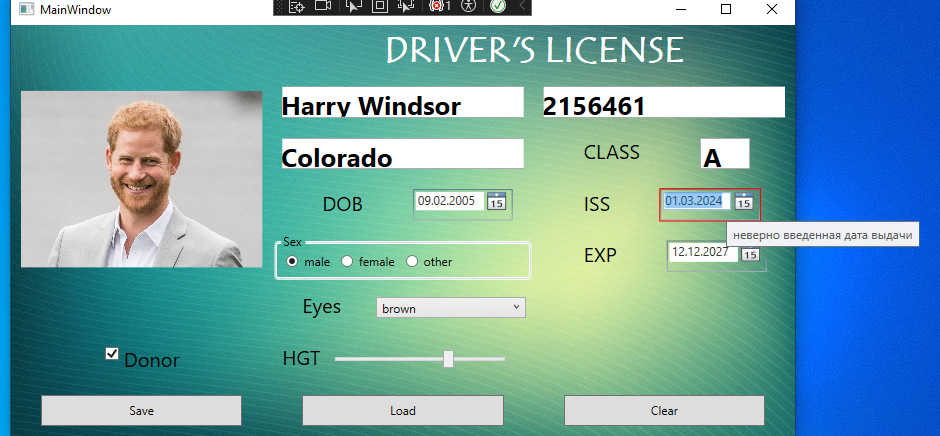
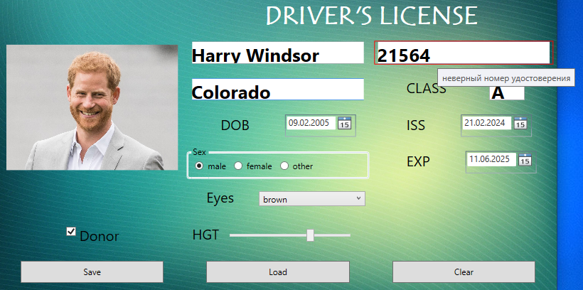

**СВПП. Лабораторная работа 3**

**Привязка данных и валидация**

Лабораторная работа выполняется на основе разметки, созданной в лабораторной работе 2.


Новый объект driver должен создаваться один раз в конструкторе окна или при инициализации. Заполните все поля объекта driver.

По кнопке Load заполните все поля объекта driver новыми значениями.

1. **Привязка**

Установите привязку к соответствующим визуальным элементам окна.

По кнопке Save выведите всю информацию о текущем состоянии объекта, используя MessageBox.

Используя интерфейс INotifyPropertyChanged добейтесь, чтобы все визуальные элементы обновлялись при изменении объекта (проверьте по кнопке Load).

1. **Конвертеры значений**

Для свойства Gender и RadioButton используйте конвертер.

Элемент ComboBox требуется заполнить не просто названиями, а непосредственно значениями перечисления COLOREYES. Это можно сделать в разметке:

```
<ObjectDataProvider x:Key="EyesFromEnum"

`                            `MethodName="GetValues" 

`                            `ObjectType="{x:Type sys:Enum}">

`            `<ObjectDataProvider.MethodParameters>

`                `<x:Type TypeName="local:COLOREYES"/>

`            `</ObjectDataProvider.MethodParameters>

`        `</ObjectDataProvider>
```

Подключим к comboBoxEyes

```
ItemsSource="{Binding Source={StaticResource EyesFromEnum}}"
```

Привязка выбранного значения осуществляется через параметр SelectedValue.

Для фото нужно привязать string UriImage к свойству Source элемента Image. Здесь также потребуется конвертер.

Для загрузки картинки используйте 
```
new BitmapImage(new Uri(value.ToString(), UriKind.RelativeOrAbsolute))
```







1. **Валидация значений**

Добавьте валидацию значений:

1. Номер удостоверения должен содержать только цифры и английские буквы.
1. Категория прав должна содержать только корректные значения.
1. Дата рождения – не раньше 1900 года и на текущий момент владельцу должно быть не менее 16 лет.
1. Дата выдачи – не раньше 16 лет и не позже текущей даты.
1. Срок действия – не раньше текущей даты.

В случае ошибки – появляется оранжевая рамка вокруг элемента толщиной 6 пкс. Для этого вам потребуется шаблон.

Добавьте всплывающую подсказку с сообщением об ошибке (используйте триггеры).






